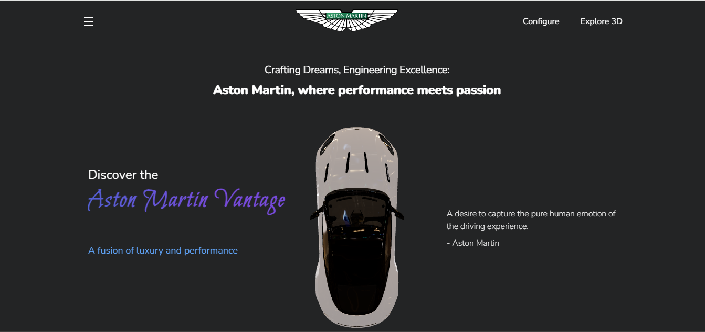
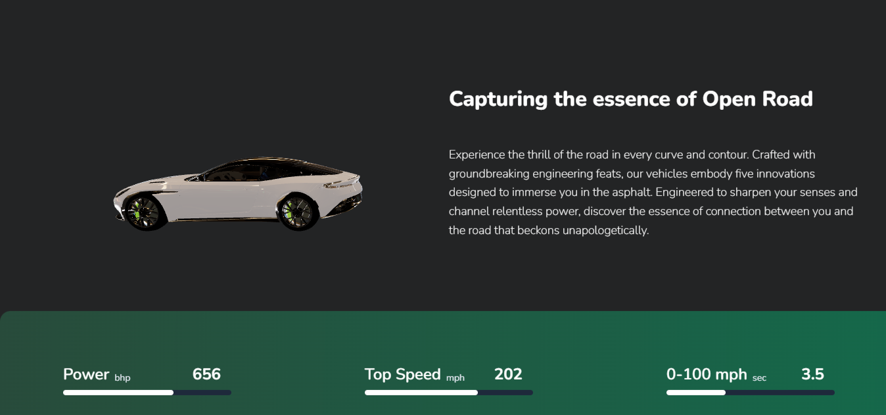
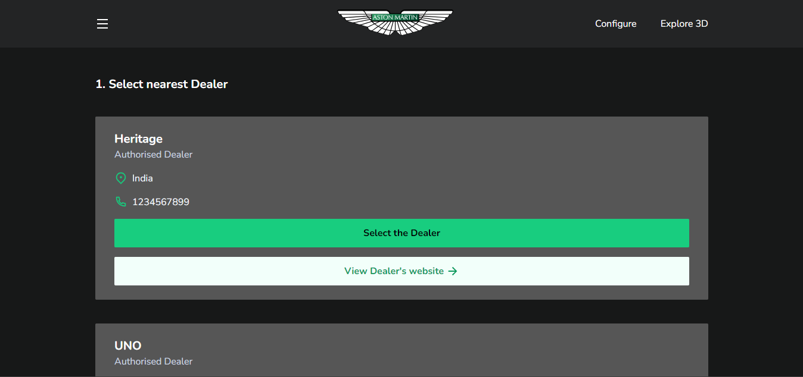
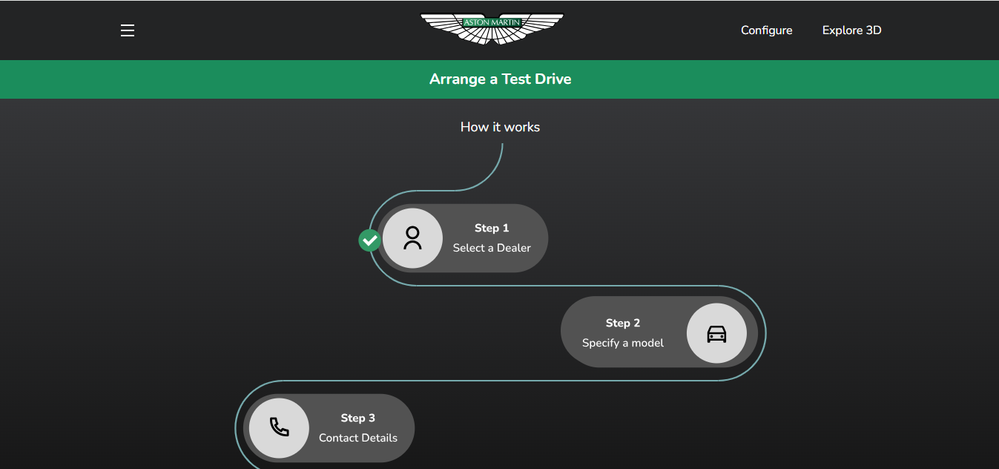



**Project Documentation**

 ## Aim: ##
To create a stunning redesigned website for the iconic car brand Aston Martin.
 ### Problem: ###
  Despite the vast array of car brands available, consumers often struggle to find comprehensive and reliable information about each brand's offerings, features, and specifications. This lack of centralized and user-friendly resources results in a fragmented search experience, leading to frustration and decision-making challenges for potential car buyers.
  ### Solution: ###
 Our solution is to create a comprehensive car brand website that centralizes detailed information about various automotive brands, their models, features, specifications, reviews, and comparisons. By offering a user-friendly interface and regularly updating content.
## Theory: ##
- The redesigned website can serve as a digital platform to showcase Aston Martin's vehicles, brand identity, and heritage while engaging users and promoting customer interaction.
- For the **Project Idea Generation**, multiple rounds of refinement and iteration were taken by the group to enhance the quality and user experience. The opportunity to learn something new was always taken into consideration.
 ### Building Website ###
- We employed a combination of React.js, HTML, CSS, and GSAP (Green Sock Animation Platform) to animate lifelike 3D car model. By harnessing GSAP's powerful animation capabilities within the React framework, we achieved seamless motion and realistic visual effects, enhancing the overall user experience and creating dynamic interactions with our 3D car models.
  - **Software Requirement:** 
    - Front End - React JS.
    - Back End - MongoDB and ExpressJS.
    - 3D animations using React three fiber and GSAP.
  - **Hardware Requirement:** Laptop.
- Using 3D animation, we'll showcase the Aston Martin DB11 Model, highlighting its sleek interior and exterior design, powerful engine, luxurious interior, and advanced technological features. Through dynamic animations, viewers will experience the car's aerodynamic contours, signature grille, and high-performance capabilities, providing an immersive exploration of its key features and attributes.
- Users can ***Customize*** the Car according to their wish. Be it Paint,Grill, or interior seats, everything inside & outside of the car can be modified. Our website provides an interface for such modifications
- Also, for User’s ease we have added an option of ***Test Drive*** with which the user will be able to know more about the handling of the car, also it is distributed in steps for the sake of convinience. Through this the user will get enough information about the overall handling.
- The Dealer's details are stored in the ***Backend*** and are fetched through API calls, which are then displayed to the user for selection.
- To enhance user Interactivity, we have kept a separate section of ***Explore*** wherein user can interact with the 3D model of their favourite car model, thus exploring the car both internally and externally.
- ***Deployment*** The website is deployed on Netlify, thus any user from all over the world can experience and use the Aston-Martin-Redesigned website without having to install or setup anything.
- **Code for the Website**:
  
  Github Repo: [https://github.com/Tanish2207/AstonMartin-Redesigned](https://github.com/Tanish2207/AstonMartin-Redesigned)
- **Deployed website** : 
[https://main--aston-martin-redesigned.netlify.app/](https://main--aston-martin-redesigned.netlify.app/)
## Some Screenshots: ##

## Conclusion: ##
In conclusion, the redesigned Aston Martin website project successfully combines cutting-edge design, seamless functionality, and immersive user experience, epitomizing the brand's essence of luxury and innovation in the digital realm.
